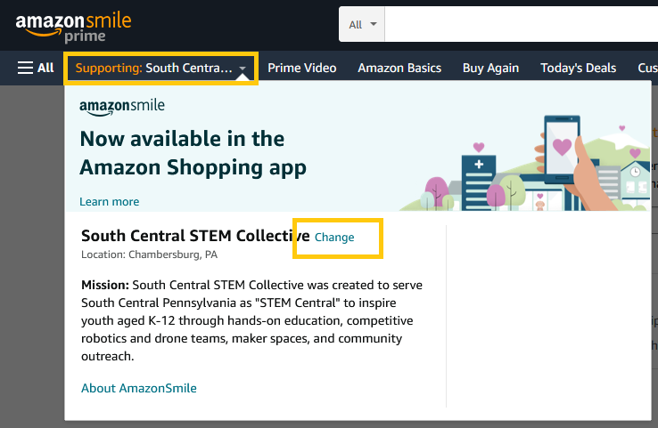
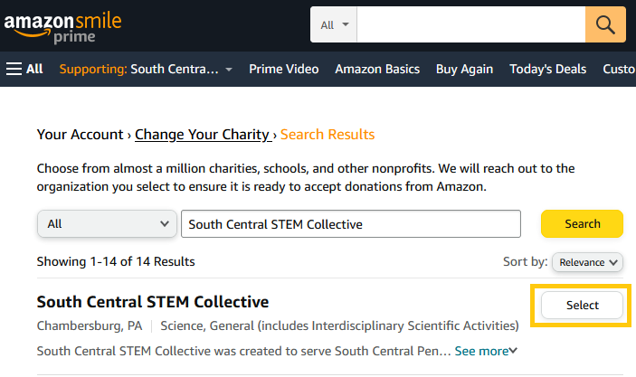
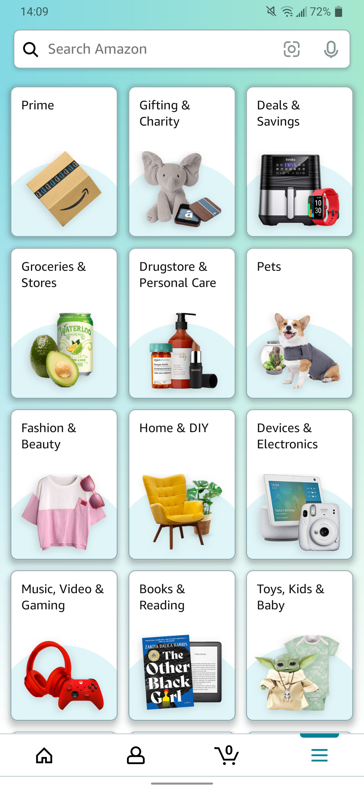
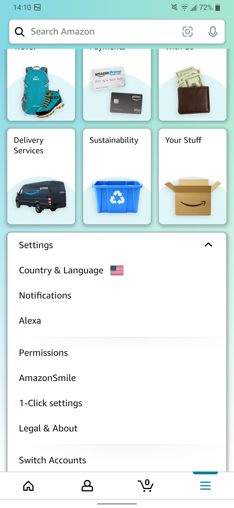

---
keywords:
  - Donate
  - Support
  - Amazon Smile
  - Non-profit

tags:
  - Donations
---

# Amazon Smile

[Amazon Smile](https://smile.amazon.com/charity/smile/about) is a free and easy way to support your favorite charities and non-profits at no cost to you! By simply selecting _South Central STEM Collective_ as your charity, Amazon will donate 0.5% of every purchase you make to us. Although this sounds small, it is by no means insignificant and every little bit helps! Below are instructions for getting started with both the Amazon website and the mobile app:

## Website

1. Go to [smile.amazon.com](https://smile.amazon.com) in your favorite internet browser.

:::note
If you already have Amazon Smile set up for anothe r charity and you want to switch your charity to us, simply open the Amazon Smile dropdown and press **Change**.

:::

2. If you do not have Amazon Smile already set up, it will ask you to search for a charity. Just type in `South Central STEM Collective` and press **Search**.

3. Select _South Central STEM Collective_ from the list.
   

4. And that's it! Just make sure anytime you make a purchase through Amazon, you are going to [smile.amazon.com](https://smile.amazon.com) and not amazon.com.

:::tip
If you use Google Chrome, Mozilla Firefox, or Microsoft Edge, there is a great Extension/Add-on called _Amazon Smile Redirect_ which will automatically redirect your browser to Amazon Smile whenever you visit.

- [Chrome Web Store](https://chrome.google.com/webstore/detail/amazon-smile-redirect/ejglonclnjogoiegggjjcpapffbnangg?hl=en)
- [Firefox Add-on Store](https://addons.mozilla.org/en-US/firefox/addon/amazon_smile_redirect/)
- [Edge Add-on Store](https://microsoftedge.microsoft.com/addons/detail/amazon-smile-redirect/ojfbbnlijdmckaehmhlnjgmpnbhjjibn)

_Disclaimer: This is a 3rd-party add-on and is not supported by SC2. Please report any issues to the developer directly. If this add-on ever goes unmaintained or is hijacked, feel free to [get in touch](/webmaster)._

:::

## Mobile App

1. Install the Amazon Shopping app on your phone

   - [Google Play Store](https://play.google.com/store/apps/details?hl=en&id=com.amazon.mShop.android.shopping)
   - [Apple App Store](https://apps.apple.com/us/app/amazon-shopping/id297606951)

2. Launch the Amazon Shopping app and go to Settings by tapping the hamburger button <svg xmlns="http://www.w3.org/2000/svg" fill="none" viewBox="0 0 24 24" strokeWidth={1.5} stroke="currentColor" style={{width: "1.5rem"}}><path strokeLinecap="round" strokeLinejoin="round" d="M3.75 6.75h16.5M3.75 12h16.5m-16.5 5.25h16.5" /></svg>, then scroll to the bottom.

   | Hamburger Menu                                                                        | Scroll to the bottom                                                                               |
   | ------------------------------------------------------------------------------------- | -------------------------------------------------------------------------------------------------- |
   |  |  |

3. Tap **AmazonSmile** and then tap the button to turn on Amazon Smile.

   - There are a few steps the app will walk you through
   - During this process, you will want to search for _South Central STEM Collective_ as your charity

4. That's it, your AmazonSmile donations are set up!

:::caution Renewal Date

Make note of the _Renewal Date_ your app displays in the AmazonSmile menu. This is the date Amazon turns off your Smile donations, so you will have to manually re-enable. Your renewal date occurs every 6-months.

:::
